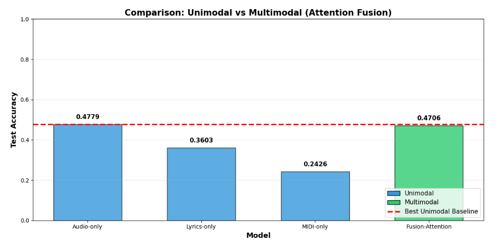
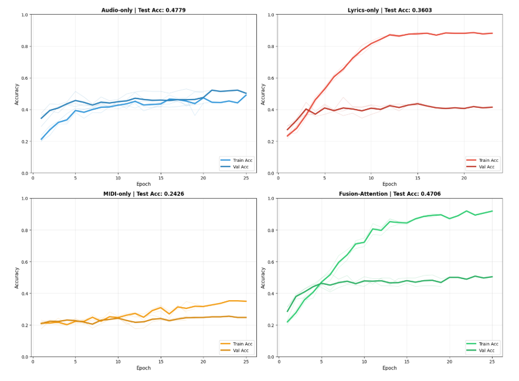

# Tugas Besar Pembelajaran Mesin Multimodal - Kelompok 3

## Multimodal Mirex Music Mood Classification

## Anggota Kelompok:
- 122140137 - Ikhsannudin Lathief
- 122140139 - Keti Azura
- 122140 - A Kevin Sergian
- 122140 - Fayyadh Abdillah
- 122140 - Muhammad Nelwan Fakhri
- 122140 - Martua Kevin A.M.H Lubis

## Tautan Notebook Kaggle
Tautan: [Kaggle](https://www.kaggle.com/code/lathief137/tugas-besar-mml-kel3)
Perkiraan Waktu Training: 9 Jam

## Model Yang Digunakan
- Modalitas Audio: PANNs CNN14 (Pretrained)
- Modalitas Lyric: BERT (Pretrained)
- Modalitas MIDI: Resnet18 (Pretrained)
- Fusion: Intermediate Fusion (Cross Attention)

## Performance Metric
### Komparasi Akurasi:

### Komparasi Kurva Pembelajaran:

### Confusion Matrix:

